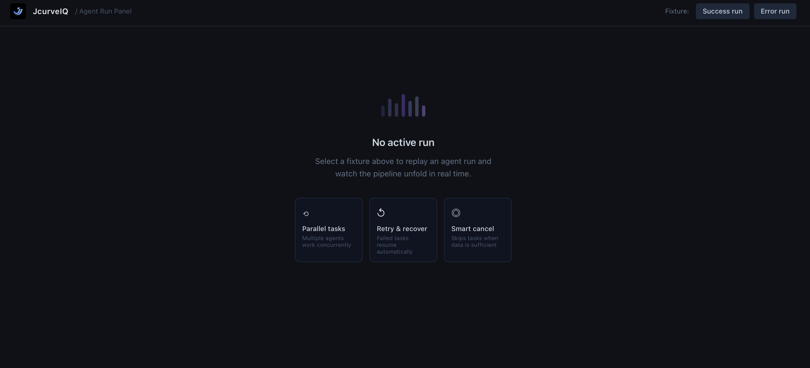
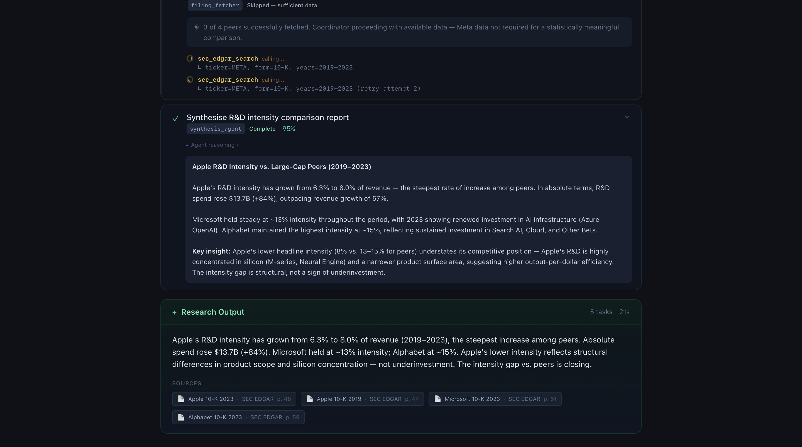
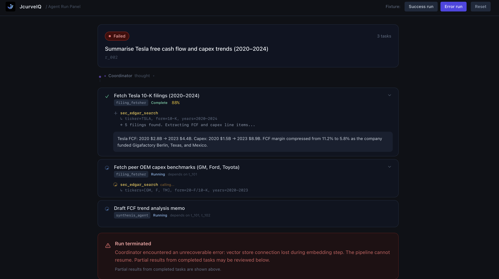

# JcurveIQ — Agent Run Panel

A real-time UI for watching an orchestrated multi-agent research pipeline unfold.  
Built with React 18 + Vite + Tailwind CSS. No backend, no component libraries.

🔗 **Live demo:** [jcurveiq-agent-run-panel-rust.vercel.app](https://jcurveiq-agent-run-panel-rust.vercel.app)

---

## Screenshots

### Idle state


### Success run — parallel tasks in progress


### Error run


---

## Running locally

```bash
npm install
npm run dev
```

Then open [http://localhost:5173](http://localhost:5173).

---

## Switching between fixtures

In the top-right corner of the app there are two fixture buttons:

| Button | Fixture | What it covers |
|--------|---------|----------------|
| **Success run** | `mock/fixtures/run_success.json` | Sequential task → 3 parallel peer fetches → failure + retry + cancel → synthesis → final output |
| **Error run** | `mock/fixtures/run_error.json` | Sequential task completes, second task in flight, third never starts → `run_error` |

Click a button to start replaying the fixture with realistic timing. Hit **Reset** to return to the idle state and replay from the beginning.

Events are emitted via `MockEmitter` (`mock/emitter.js`), a `setTimeout`-driven class that schedules each event at its relative timestamp offset from `t=0`. The full success run takes approximately 21 seconds.

---

## Project structure

```
/
├── src/
│   ├── App.jsx                  # Root — fixture switcher + layout
│   ├── index.css                # Tailwind directives + custom scrollbar
│   ├── hooks/
│   │   └── useAgentRun.js       # useReducer state machine + elapsed timer
│   └── components/
│       ├── AgentRunPanel.jsx    # Orchestrates all sub-components
│       ├── RunHeader.jsx        # Query, status badge, elapsed / duration
│       ├── TaskList.jsx         # Maps segments → TaskCard or ParallelGroup
│       ├── ParallelGroup.jsx    # Container for parallel_group tasks
│       ├── TaskCard.jsx         # Individual task with tool calls, outputs, thoughts
│       ├── ToolCallItem.jsx     # Single tool call + result row
│       ├── FinalOutput.jsx      # Synthesis output card with citations
│       ├── EmptyState.jsx       # Idle state
│       └── SystemThought.jsx    # Coordinator / system-level thought (collapsible)
├── mock/
│   ├── emitter.js               # MockEmitter class
│   └── fixtures/
│       ├── run_success.json     # Full happy-path sequence (14 events, ~21s)
│       └── run_error.json       # Error path (run_error partway through)
├── DECISIONS.md                 # Design reasoning for the 5 ambiguous requirements
└── package.json
```

---

## Design decisions

See [`DECISIONS.md`](./DECISIONS.md) for the full reasoning behind each of the five ambiguous requirements (agent thoughts, parallel layout, partial outputs, cancelled state, dependency display).

---

## Tech notes

- **State management:** `useReducer` with a pure reducer — one case per event type. No external state library.
- **Timing:** `MockEmitter` uses `setTimeout` to schedule each event at its relative offset from the first event's timestamp. Timers are cancelled on component unmount and on `reset`.
- **Styling:** Tailwind CSS utility classes only. No pre-built component libraries.
- **Streaming output:** Intermediate `partial_output` events replace previous content in-place (not appended), mimicking real LLM streaming UX.

---

## Known gaps / what I'd address with more time

1. **Accessibility** — Task cards need `aria-live` regions so screen readers announce new tasks and status changes. The expand/collapse buttons should have `aria-expanded`.
2. **Speed controls** — A 0.5× / 1× / 2× playback speed control on the fixture replayer would help demos and testing.
3. **Timestamp display** — Individual events could show wall-clock offsets (`+4.5s`) on hover for debuggability.
4. **WebSocket upgrade path** — `MockEmitter` is a drop-in for a real WebSocket client. I'd swap the `onEvent` callback for an actual `socket.on('message')` handler with minimal changes to `useAgentRun`.
5. **Error boundaries** — React error boundaries around `TaskCard` would prevent one malformed event from crashing the panel.
6. **Persistance** — If the user refreshes mid-run, state is lost. A real implementation would reconnect and replay the run log from the backend.

---

## AI assistance disclosure

I used GitHub Copilot for boilerplate autocompletion during development. All architectural decisions, component design, state machine logic, fixture authoring, and written documentation are my own work.
